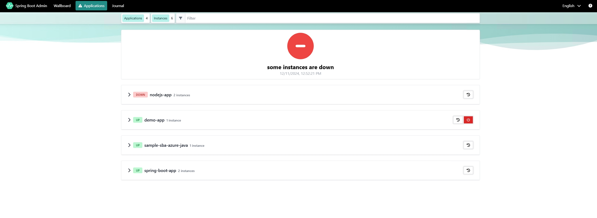
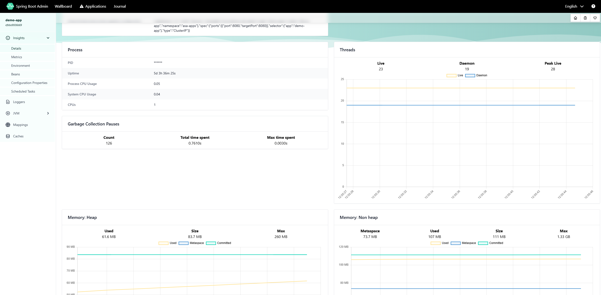

# Quick Start Guide: Java Diagnostic Tool (diag4j) on AKS

## Introduction
This guide provides step-by-step instructions to set up and start using the Java Diagnostic Tool (diag4j) on Azure Kubernetes Service (AKS). By following these steps, developers can monitor and diagnose their Java applications efficiently.

## Prerequisites

Before starting, ensure the following prerequisites are met:

1. Kubernetes Cluster: A running AKS cluster with necessary permissions.
1. kubectl: Installed and configured to access the AKS cluster.
1. Helm: Installed on your local machine.
1. Java Applications: Applications deployed in AKS (better with Spring Boot actuator endpoints enabled.)
1. Permissions: Developer access to the namespace hosting diag4j. Ensure you can execute `kubectl port-forward`.

## Steps

### Step 1: Install diag4j in Your Cluster

1. Add the diag4j Helm repository:
    ```bash
    helm repo add diag4j-repo https://microsoft.github.io/diag4j
    helm repo update
    ```

1. Install diag4j in the desired namespace:

    ```bash
    helm install diag4j diag4j-repo/diag4j --version 1.1.5 -n <namespace> --create-namespace
    ```

### Step 2: Create a Spring Boot Admin component

1. Apply the following CR to create a Spring Boot Admin component:

    > **Note**: Replace `<namespace>` with the namespace where Spring Boot apps are running in. SBA will auto-discover apps whose actuator endpoints are exposed. Others will show as `DOWN` status on the dashboard.
    ```yaml
    apiVersion: diagtool4j.microsoft.com/v1alpha1
    kind: Component
    metadata:
        name: spring-boot-admin
        namespace: <namespace>
    spec:
        type: SpringBootAdmin
    ```

    Save the file as `spring-boot-admin.yaml` and apply it:

    ```bash
    kubectl apply -f spring-boot-admin.yaml
    ```

### Step 3: Access the diag4j Dashboard

1. Port Forwarding
    
    Access the Spring Boot Admin (SBA) server locally by forwarding its port:

    ```bash
    kubectl port-forward svc/spring-boot-admin-azure-java -n <namespace> 8080:8080
    ```

1. Navigate to http://localhost:8080 in your browser to view the SBA dashboard, all applications in the same namespace should be registered automatically.



1. Click on an application to view its details, metrics, and logs.



